# 实战JAVA虚拟机

# java语言规范

语法，词法，支持的数据类型，变量类型，数据类型转换的约定，数组，异常等，告诉开发人员“java代码应该怎么样写”

## 词法

什么样的单词是对的。

>整数可以有下划线

## 语法

什么样的语句是对的。

## 数据类型的定义

char为16位无符号整数。
float和double为满足IEEE754的32位浮点数和64位浮点数。

引用数据类型分为3重
* 类/接口
* 泛型类型
* 数组类型

## 数字编码

整数用补码表示，正数的补码是本身，负数的补码就是反码+1。反码就是符号位不变，其他位取反。

### 补码的好处
* 0既不是正数也不是负数，反码不好表示，补码则相同。
* 补码将加减法的做法完全统一，无需区分正数和负数

### 浮点数的表示

IEEE754规范，一个浮点数由符号位，指数位和尾数位3部分组成。
32位的float类型，符号位1位，指数位8位，尾数位为23位。

> s eeeeeeee m(23个）

> 当e全部为0的时候，m前面加0，否则加1


浮点数取值为 s * m * 2的（e-127）次方

-5 = 1 1000001 010（21个0）

因为 e 不全为0，前面加个1，实际尾数为 1010（21个0）

```
-5 = -1 * 2的（129-127）次方 * （1*2的0次方+0*2的-1次方+1*2的-2次方+0*2的-3次方+后面都是0）
    = -1 * 4 * （1 + 0 + 1/4 + 0 ...）
    = -1 * 4 * 1.25
    = -5
```

```java
float f = -5;

// float的内部表示
System.out.println(Integer.toBinaryString(Float.floatToRawIntBits(f)));
//1  10000001(指数位8位)  01000000000000000000000（23位）


double d = -5;

//1 10000000001（指数位11位） 0100000000000000000000000000000000000000000000000000（52位）
// double 的内部表示
System.out.println(Long.toBinaryString(Double.doubleToRawLongBits(d)));
```

# 基本结构

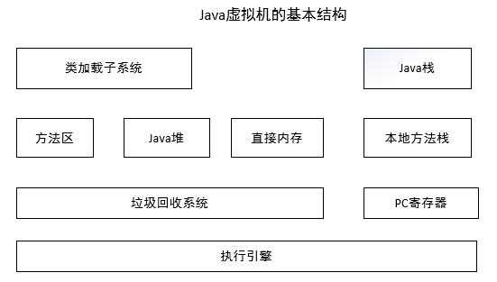

NIO可以使用直接内存（堆外内存）。

PC：如果是不是本地方法，PC指向正在执行的指令，如果是本地方法，PC就是undefined。

## 堆

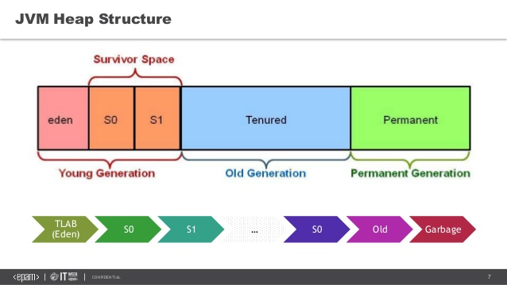

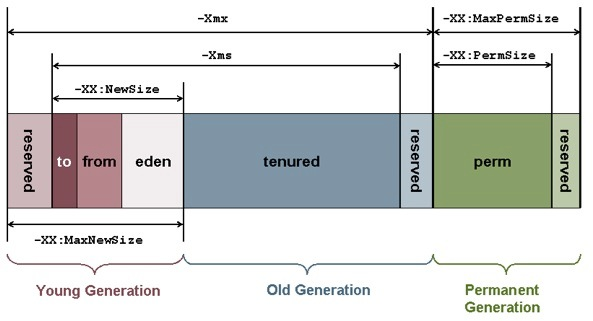

## 栈

> -Xss128K 指定最大栈空间。

线程私有的内存空间。

至少包含：
* 局部变量表
* 操作数栈
* 帧数据区

函数被返回的时候，栈帧被弹出。二种方式
* 正常返回，就是return
* 异常抛出

栈深度太大，会抛出 **StackOverflowError** 栈溢出错误。


### 局部变量表

保持函数的参数和局部变量。越多越大，嵌套调用次数就会减少。

```java
    public static  void recursion(int i1, float f1, long l1, double d1){
        count++;

        // 局部变量
        int i2=1; // 1 word = 32bit
        float f2 = 2f; // 1 word
        long l2 = 3L; // 2 word
        double d2 = 4; // 2 word

        Object o1= null; // 1 word
        Object o2= null; // 1 word

        recursion(i1,f1,l1, d1);
    }
```

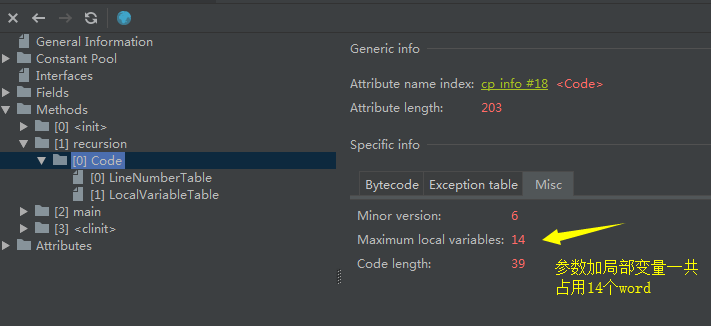

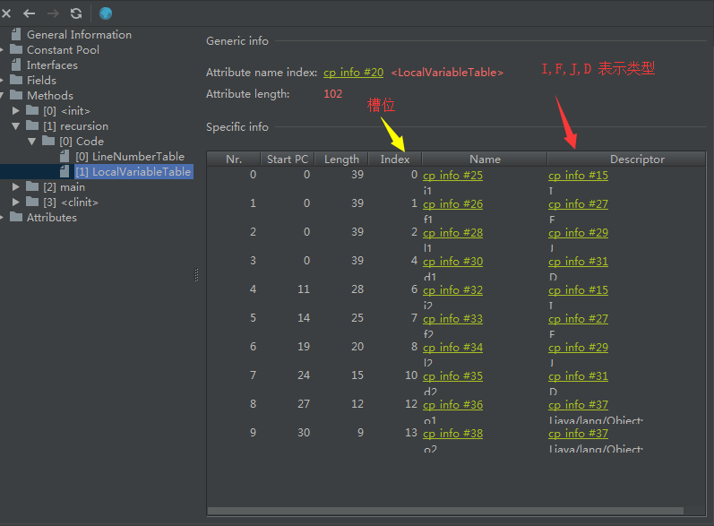

**槽位复用**

```java
    // 复用槽位
    public static  void recursion2(int i1){
        {
            int i2 = i1;
            System.out.println(i2);
        }

        int i3 = 1;
    }
```

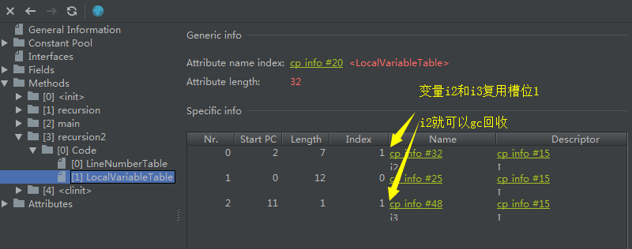

**占2word的槽位的复用**

```java
// 局部变量表是4 word
public static  void recursion3(double d1){
    {
        double d2 = d1; // 2 word
        System.out.println(d2);
    }

    int i3 = 1; // 1 word 复用 d2的第一个1槽位
    int i4 = 2; // 1 word 复用 d2的第二个操作
}

```

**槽位和gc**

```java
public static  void gc(){
    {
        byte[] a = new byte[6*1024*1024];
    }

    // a 虽然失效，但仍然在局部变量表，无法gc
    System.gc();
}

public static  void gc2(){
    {
        byte[] a = new byte[6*1024*1024];
    }

    int c = 1;

    // a 失效，槽位重用，a已经不存在，可以回收
    System.gc();
}
```

### 异常处理表

异常处理表是帧数据区重要的一部分

```java
public static void main(String[] args) {
    try {
        recursion(1,2,3,4);
    }
    catch (Throwable e){
        System.out.println(count);
        e.printStackTrace();
    }
}
```

**机器码如下**

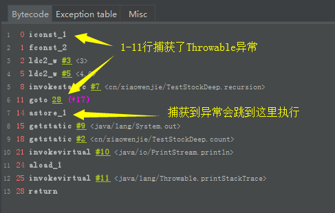


**异常表如下**

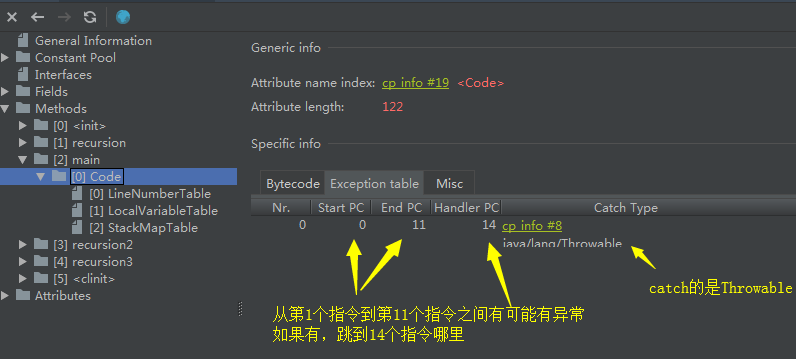


## 栈上分配

基础的基于 **逃逸分析** （判断对象的作用域是否可能逃逸出函数体）

必须 **server模式** 。栈上分配并没有真正实现，是通过标量替换实现的。？

> -server -XX:+DoEscapeAnalysis -XX:+EliminateAllocations


**逃逸分析**

* 同步消除
* 标量替换

通过-XX:+**EliminateAllocations** 可以开启标量替换， -XX:+**PrintEliminateAllocations** 查看标量替换情况。

## 方法区

1.8之前可以理解为 **永久区**（PerSize，MaxPerSize）。1.8之后使用 **元数据区** 取代。（MaxMetaspaceSize）。


---
---
---


# 常用java虚拟机参数

## 查看参数

-XX:+PrintFlagsInitial 打印所有参数

-XX:+PrintFlagsFinal

-XX:+PrintCommmandLineFlags 打印传递的参数

-XX:+PrintVMOptions

## GC信息

PrintGC/PrintGCDetails

PrintHeapAtGC(GC前后堆信息)

-Xloggc:log/gc.log 日志存放


## 类加载、卸载

-verbose:class 跟踪类加载和卸载。等于 -XX:+TraceClassLoding 和  -XX:+TraceClassUnLoding

> verbose adj.冗长的；啰嗦的；唠叨的。详细；罗嗦的；详细的


## 非堆内存

-XX:MaxDirectMemorySize，如果不配置，默认为最大堆空间（-Xmx）。直接内存使用达到时候会触发GC，可能导致OOM

## 虚拟机工作模式

Client / Server /


---
---
---
# GC算法

## 引用计数器

存在循环引用和性能问题。没有采用。

## 标记清除法

标记阶段：通过根节点，标记所有可到达对象

**缺点** 回收后的空间是不连续的。

## 复制算法（新生代）

内存分2块，每次用一块。

**新生代**：分为eden，from，to 3块。from和to称为survivor区，大小一样的2块。

**老生代**

这种算法适合 **新生代** 。

## 标记压缩法（老生代）

将所有存活对象压缩到内存一端，然后直接清除边界外的空间。

## 分代算法

新生代采用复制算法，老生代采用标记压缩法/标记清除算法。

### 卡表（Card Table）

卡表中每一个位表示年老代4K的空间，卡表记录未0的年老代区域没有任何对象指向新生代，只有卡表位为1的区域才有对象包含新生代引用，因此在新生代GC时，只需要扫描卡表位为1所在的年老代空间。使用这种方式，可以大大加快新生代的回收速度。

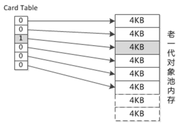

卡表为1的时候，才扫描对应的老生代。

新生代GC的时候，只需要扫描所有卡表为1所在的老生代空间。加快新生代GC时间。

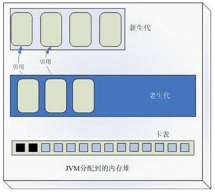

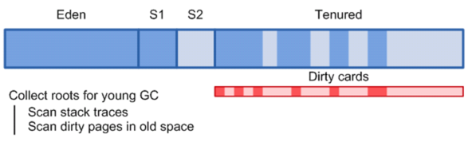


## 分区算法

内存分为多个区处理。


## 可触及性

包含3种状态

* 可触及的：根节点开始可到达。
* 可复活的：对象所有引用被释放，但是对象可能在finalize函数中复活。
* 不可触及的：finalize函数已经调用，而且没有复活。

## 引用

* 强引用
* 软引用：可被回收。GC 不一定会回收，但内存紧张就会被回收，不会导致OOM。
* 弱引用：发现就回收，不够空间够不够。
* 虚引用：对象回收跟踪，必须和引用队列一起使用，作用在于跟踪垃圾回收过程。

## STW（Stop-The-World）


---
---
---
# 垃圾收集器和内存分配

## 串行回收器

-XX:+UseSerialGC，老生代和新生代都使用。

## 并行回收器

### 新生代 ParallelGC 回收器

复制算法

### 老生代 ParallelOldGC 回收器

关注吞吐量。

## CMS回收器

标记清除算法。

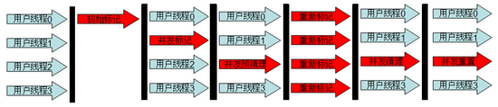

* 初始标记：STW，标记根对象
* 并发标记：标记所有对象
* 预清理：清理前准备以及控制停顿时间
* 重新标记：STW，修正并发标记数据
* 并发清理
* 并发重制

除了那2个STW(图片中全红的)，其他时候可以和应用线程并发执行。

## G1回收器(Garbage First)

jdk1.7的并行的分代垃圾回收器，依然区分年轻代和老生代，依然有eden区和servivor区。

没有采用传统物理隔离的新生代和老年代的布局方式，仅仅以逻辑上划分为新生代和老年代，选择的将 Java 堆区划分为 2048 个大小相同的独立 Region 块。

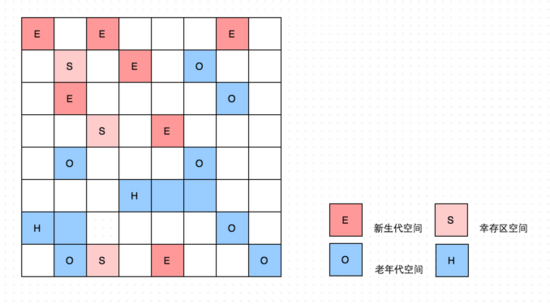

### 对象进入老生代

* 多次gc存活
* 大对象直接进入
  * 超过from/to大小
  * 超过 **PertenureSizeThredhold** 参数大小

### TLAB上分配对象

Thread Local Allocation Buffer，线程本地分配缓存。

为了加速对象分配。由于对象一般在堆上，而堆是共享的，需要同步。

占用eden区空间，在TLAB启用情况下，虚拟机会为每一个线程分配一块TLAB空间。默认很小（2048）。

-XX:+UserTLAB / -XX:PrintTLAB

-XX:TLABSize=102400 指定大小

-XX:-ResizeTLAB 大小会一直调整，可以禁止调整，一次性设置值。

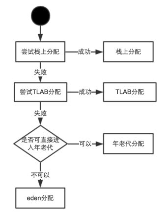

### finalize()方法对垃圾回收的影响

函数finalize是由FinalizerThread线程处理的。每一个即将回收并且包含finalize方法的对象都会在正式回收前加入FinalizerThread的执行队列。

糟糕的Finalize方法（如耗时sleep 1秒），会导致对象来不及回收，导致OOM。

**MAT** 工具可以查看 Finalizers 


---
---
---
# 性能监控工具

## Linux下工具

* top：显示系统整体资源使用情况
* vmstat：监控内存和CPU
  * vmstat 1 3   每秒一次，一共3次
* iostat：监控IO使用
  * iostat 1 3
* pidstat：多功能诊断器（sysstat组件之一）
  * 需要安装 sudo apt-get install sysstat   

## windows下工具

* perfmon windows自带的性能监控器
* pslist 需要安装
* JDK性能监控工具
  * jps 
    * jps -mlv 
  * jstat 查看堆、GC情况
  * jinfo 查看和修改jvm参数（只是某些jvm参数）
  * jmap 生成堆，实例统计信息，classloader信息，Finalizer队列
    *  jmap -histo  \<pid>
    *  jmap -dump:format=b,file=c:\heap.hprof \<pid>
  * jhat 堆分析，分析jmap的dump文件，自动开启http服务网页查看
    * 支持OOL查询语句
  * jstack 线程堆栈分析（线程状态，死锁等）
  * jstatd 远程主机信息收集（RMI服务端程序）
  * jcmd 基本上就是上面命令的合计
    * jcmd 6356 列出可以执行的命令
    * jcmd 6356 GC.run 执行gc
    * jcmd 6356 GC.run
    * jcmd 6356 GC.class_histogram
  * hprof 性能统计工具
  
## jconsole 图形化工具

## visual vm

## bttrace

不停机情况下插入字节码。可以在 **visual vm** 的 **插件** 里面使用。


---
---
---
# 分析 java 堆


## OOM类型

* Java Heap 溢出（Java heap spacess）
* 虚拟机栈和本地方法栈溢出（StackOverflowError）
* 运行时永久区溢出（PermGen space），如常量池等
* 方法区溢出 （PermGen space）
* 线程过多（unable to creat new native thread）
* GC效率低下 (GC overhead limit exceeded)
* 直接内存内存溢出 (Direct buffer memory)
* 数组过大 （Requested array size exceeds VM limit）>=Integer.MAX_VALUE-1时

## string 虚拟机中实现

* 不变性
* intern

jdk6存在内存泄漏，string的长度和value无关。jdk7已解决。

### string常量池

jdk6之前，属于永久区。jdk7后，移到了堆中。

```java
    public static void main(String[] args) {
        List<String> list = new ArrayList<String>();

        int i = 0;

        while(true){
            list.add(("dd".repeat(1000)+String.valueOf(i++)).intern());
        }
    }
```

* jdk6报: OOM：permgen space
* JDK7后报：java.lang.OutOfMemoryError: Java heap space


---
---
---
# 锁和并发

## 对象头和锁

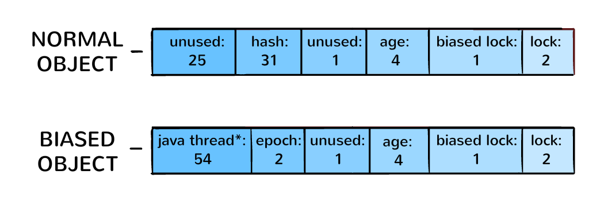

> biased - adj.偏向；偏重；有偏见的；倾向性的

锁对象头上会记录获取锁的线程，和锁的姿态。

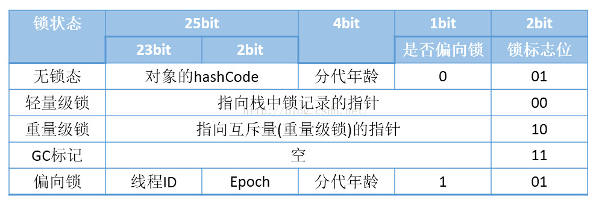

## 完整过程

**锁的转换**


**重量级锁**

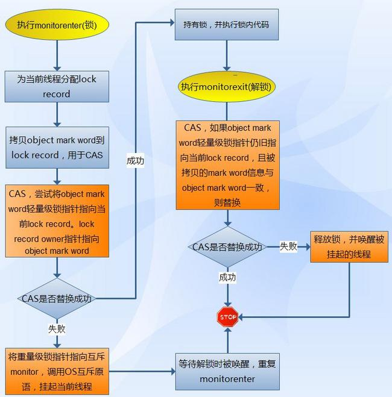


## 偏向锁

jdk1.6

> +XX:+UseBiasedLocking 启用偏向锁
> +XX:BiasedLockingStartupDelay=0 虚拟机默认4秒后启动偏向锁，可以通过设置马上启动。

锁被某个线程获取之后，进入了偏向锁模式。线程再次请求的时候，无需再次进行同步，节省时间。如果有其他线程请求锁，则退出偏向锁模式。

> 竞争激励的场景，偏向锁反而会因为频繁切换影响性能，可以使用jvm参数关掉。

## 轻量级锁

如果偏向锁**失败**，虚拟机会让线程申请轻量级锁。虚拟机内部，使用 **BasicObjectLock** 的对象实现。这个对象有一个**BasicLock对象**和一个**持有该锁的Java对象指针**组成。BasicObjectLock对象放置在java栈的**栈帧**中。BaseLock对象内部还维护着 **displaced_header** 字段，用于备份对象头部的**Mark Word**。

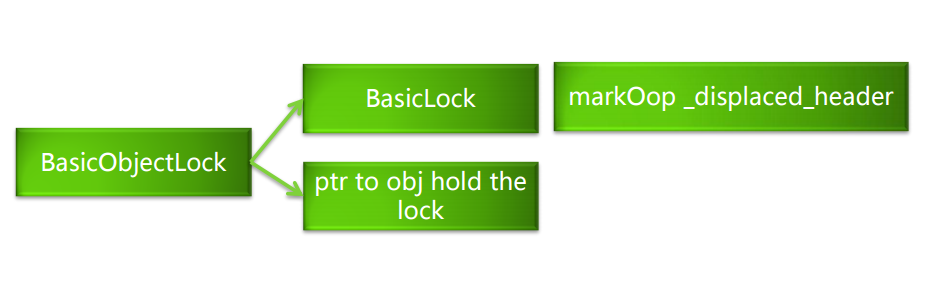

## 锁膨胀

如果轻量级锁失败，就会膨胀成重量级锁。

## 自旋锁


## 锁消除

不存在逸出的地方，编译的时候会自动去掉锁。

> -XX:+DoEscapeAnalysis -XX:+EliminateLocks

## 锁优化

* 减少锁持有时间
* 锁粗化 （大量切换请求还不如粗化）
* 减小锁粒度
* 锁分离
  * **LinkedBlockingQueue** ， 有 putLock 和 takeLock 2把 ReentrantLock 锁。

LinkedBlockingQueue 代码片段：

```java
    /** Lock held by take, poll, etc */
    private final ReentrantLock takeLock = new ReentrantLock();

    /** Wait queue for waiting takes */
    private final Condition notEmpty = takeLock.newCondition();

    /** Lock held by put, offer, etc */
    private final ReentrantLock putLock = new ReentrantLock();

    /** Wait queue for waiting puts */
    private final Condition notFull = putLock.newCondition();
```

## 无锁

### CAS （Compare And Swap）

### LongAdder（jdk8）

实质是想通过多个原子锁，来替代单一锁，减少多线程对单一锁的竞争，提高并发写的能力。distributed-cache-line-counter-scalable、LongAddr、ConcurrentHashMap都是这种思想。 

LongAdder适合的场景是 **统计求和计数的场景**，而且LongAdder基本只提供了add方法，而AtomicLong还具有cas方法。

## 将随机变为可控：理解java内存模型

### 原子性

64位的long类型读写并非原子操作。需要定义为 **volatie** 即可解决。

## 有序性

三种地方可能会导致指令重排：

* 编译器优化的重排序
* 指令级并行的重排序（指令级并行技术（Instruction-Level
Parallelism， ILP）来将多条指令重叠执行）
* 内存系统的重排序（处理器使用缓存和读/写缓冲区）

关键字：

* as-if-serial语义： 不管怎么重排序（编译器和处理器为了提高并行度），
（单线程）程序的执行结果不能被改变
* happens- before程序顺序规则


## 可见性

---
---
---
# Class 文件结构


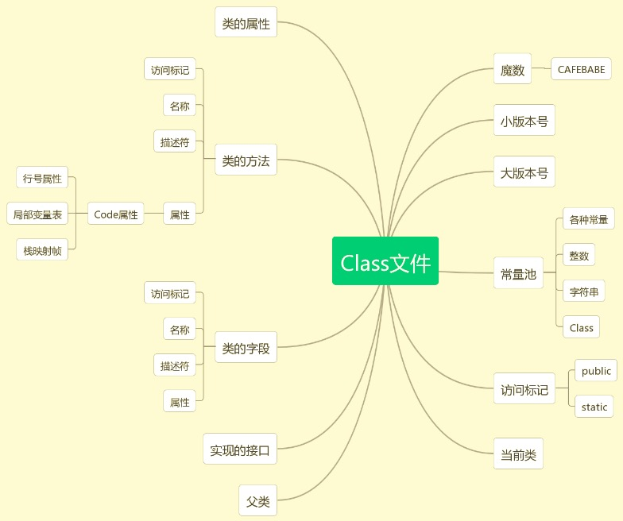


Class文件格式

Class文件格式ClassFile结构体的C语言描述如下：

```C
struct ClassFile
{
    u4 magic;                    // 识别Class文件格式，具体值为0xCAFEBABE，
    u2 minor_version;            // Class文件格式副版本号，
    u2 major_version;            // Class文件格式主版本号，
    u2 constant_pool_count;      // 常数表项个数，
    cp_info **constant_pool;     // 常数表，又称变长符号表，
    u2 access_flags;             // Class的声明中使用的修饰符掩码，
    u2 this_class;               // 常数表索引，索引内保存类名或接口名，
    u2 super_class;              // 常数表索引，索引内保存父类名，
    u2 interfaces_count;         // 超接口个数，
    u2 *interfaces;              // 常数表索引，各超接口名称，
    u2 fields_count;             // 类的域个数，
    field_info **fields;         // 域数据，包括属性名称索引，域修饰符掩码等，
    u2 methods_count;            // 方法个数，
    method_info **methods;       // 方法数据，包括方法名称索引，方法修饰符掩码等，
    u2 attributes_count;         // 类附加属性个数，
    attribute_info **attributes; // 类附加属性数据，包括源文件名等。
};
```
 

其中 u2 为 unsigned short，u4 为 unsigned long：

```c
typedef unsigned char   u1;
typedef unsigned short  u2;
typedef unsigned long   u4;
```
 

cp_info **constant_pool 是常量表的指针数组，指针数组个数为 constant_pool_count，结构体cp_info为

>注意：各种常量结构不同

```c
// 类
struct constant_class_info
{
    u1 tag;            // 常数表数据类型
    u2 name_index;     // 常数池中索引
};

// utf8字符串
struct constant_utf8_info
{
    u1 tag;            // 常数表数据类型
    u2 length;         // 长度
    u1 bytes[length];  // 数据
};
```


## 重点看看方法结构

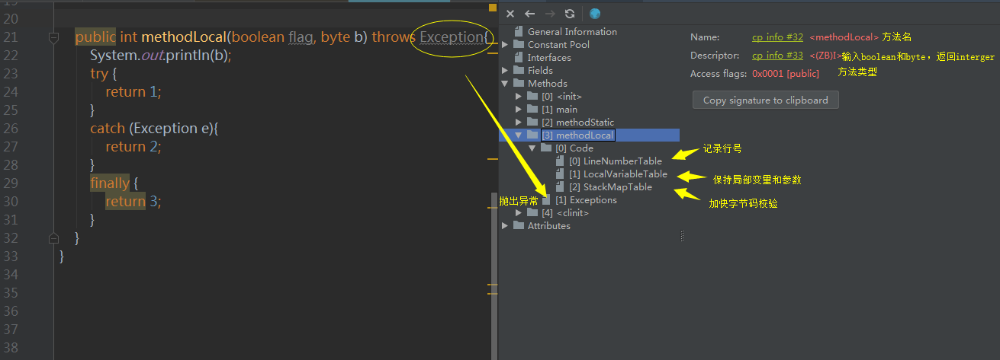

### line-number-table

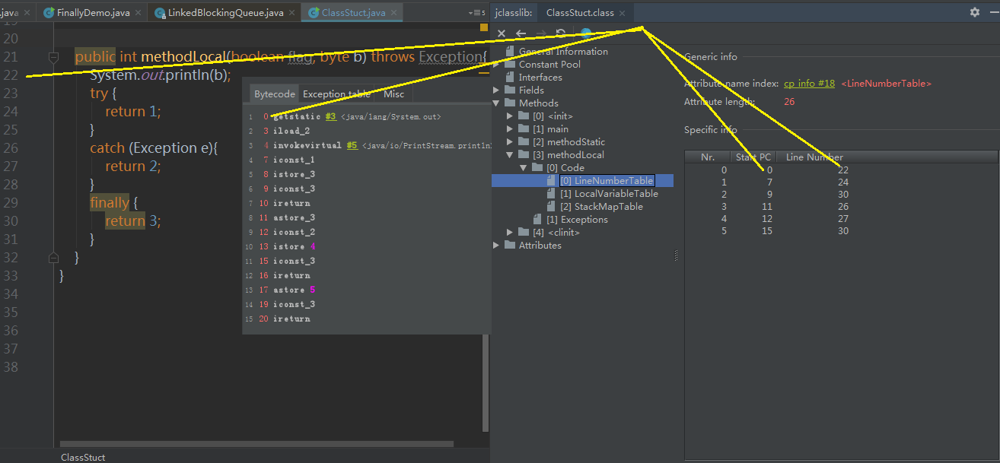

### exception-table


## 强大的动态调用 - BootstrapMethods属性

lambda表达式的实现


---
---
---
# Class 装载系统

## 装载流程


### 类装载条件

>参考: [Java 类主动引用和被动引用](https://blog.csdn.net/qq_33314107/article/details/79109524)

必须使用的时候才装载。使用分主动和被动。

**主动**：

* 遇到new、getstatic、putstatic、invokestatic这4条字节码指令时，如果类没有进行过初始化，则需要先触发其初始化
    * new = new 对象
    * invokestatic = 调用类的静态方法
    * getstatic、putstatic = 调用类中的静态成员，除了final字段
* 使用java.lang.reflect包的方法对类进行反射调用的时候，如果类没有进行过初始化，则需要先触发其初始化。
* 当初始化一个类的时候，如果发现其父类还没进行过初始化，则需要先触发其父类的初始化。
* 当虚拟机启动时，用户需要指定一个要执行的主类（main方法），虚拟机会先初始化这个主类。

**被动使用**：（看上去会，其实不会发生初始化）

* 通过子类引用父类的静态字段，不会导致子类初始化
* 通过数组定义类引用类，不会触发此类的初始化
* 常量在编译阶段会存入调用类的常量池中，本质上没有直接引用到定义常量的类，因此不会触发定义常量的类的初始化

### 加载类

**过程**：

1. 通过类全名，获取类的二进制数据流
    1. 一般为读入class后缀文件
    2. 也可以读入zip，jar文件
    3. 数据库，http链接都可以
2. 解析为方法区内的数据结构
3. 创建java.lang.Class类的实例，表示该类型


### 验证

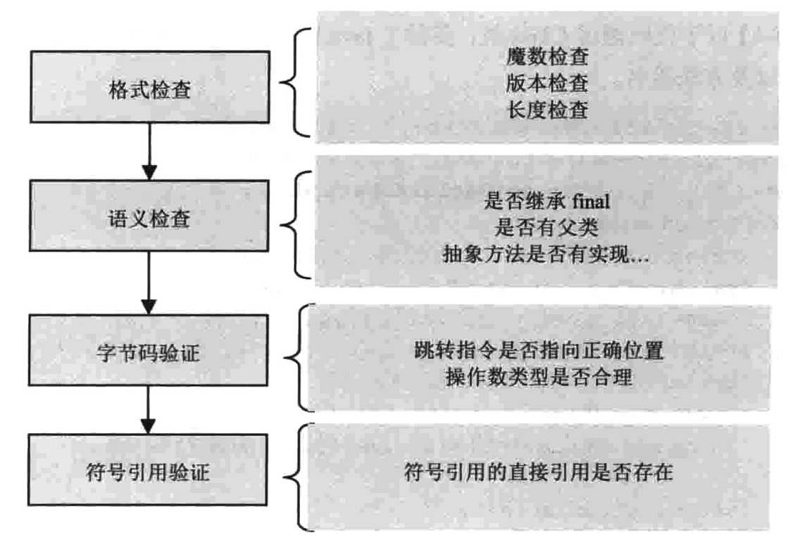

### 准备

分配空间，并设置初始值。

>java并不支持boolean类型，内部实现是int，int的默认值是0，boolean默认值就是false。

如果类存在常量字段，会被赋上正确的值。这个赋值属于java虚拟机行为，属于变量的初始化。（就是class信息上能看到）**准备阶段，不会有任何java代码被执行**。

### 解析类

将类、接口、字段和方法的**符号引用**转换为**直接引用**。

符号引用：就是一些字面量的引用，和虚拟机的内部数据结构和内存布局无关。class类文件中，通过**常量池**进行了大量的符号引用。

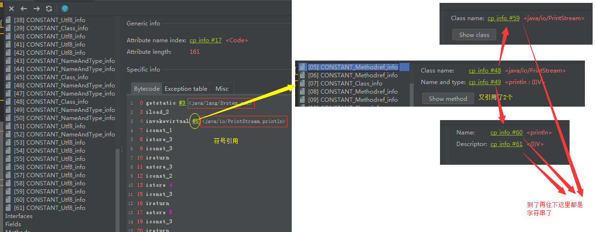

> string的intern方法，intern是 **拘留** 的意思。
> 
> intern :  1. 实习生 2. 拘留


### 初始化

执行java字节码，重要工作就是执行类的初始化方法 **\<clinit\>** (class init)，该方法由编译器自动生成，由类的 **静态成员的赋值语句** 以及 **static语句块** 合并产生的。

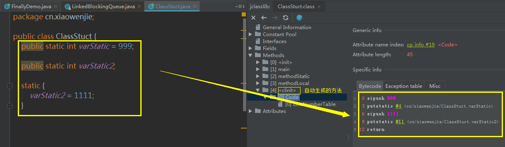


**不一定会有clinit方法**，如果只有静态的常量，就不会有。如果是变量，会有。

clinit 方法是**带锁线程安全**的（但方法上并没有synchronize关键字），多线程初始化的时候，可能引起**死锁**！

### 使用

### 卸载

## ClassLoader

ClassLoader负责类的加载（通过各种方式将class的二进制数据流读入系统），然后交给java虚拟机进行连接、初始化等操作，只能影响类的加载，无法改变类的连接和初始化行为。

### 4个重要方法

```java

public Class<?> loadClass(String name) throws ClassNotFoundException {
    return loadClass(name, false);
}

@Deprecated(since="1.1")
protected final Class<?> defineClass(byte[] b, int off, int len)
    throws ClassFormatError


protected Class<?> findClass(String name) throws ClassNotFoundException {
    throw new ClassNotFoundException(name);
}

protected final Class<?> findLoadedClass(String name) {
    if (!checkName(name))
        return null;
    return findLoadedClass0(name);
}
```

### ClassLoader的分类

虚拟机创建了3类
* BootStrap ClassLoader 启动类加载器
* Extension ClassLoader 扩展类加载器
* App ClassLoader 应用类加载器（也叫系统类加载器 System ClassLoader）


层次结构：

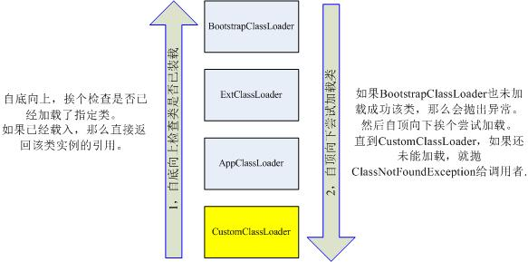


BootStrap ClassLoader 无法获取到实例，是系统级纯C实现的。所以ExtClassLoader的getParent为null。

### 双亲委托模式

**往上查找，往下加载**

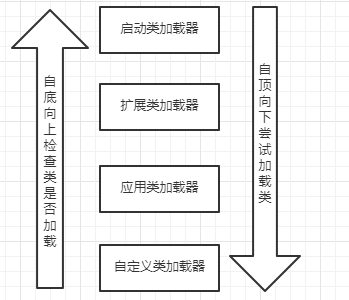

>-Xbootclasspath可以把指定目录加到启动的classpath中。那么这里的类就会由启动类加载器加载。但是，如果这个类没有使用过，bootstrap ClassLoader不会主动加载，你可以在自定义的ClassLoader加载。

```java
/**
 *  使用-Xbootclasspath可以把包含 另外一份HelloLoader.class 的目录加到启动的classpath中。
 *  理论上应该由bootstrap ClassLoader加载。
 *  但我们可以先在自己的app loader里面加载他。（必须在使用他之前）
 */
public class FindClassLoader {

    public static void main(String[] args) throws InvocationTargetException, IllegalAccessException, NoSuchMethodException {
        ClassLoader loader = FindClassLoader.class.getClassLoader();

        byte[] bytes = loadClassBytes("cn.xiaowenjie.classloader.HelloLoader");

        Method defineClass = ClassLoader.class.getDeclaredMethod("defineClass", byte[].class, int.class, int.class);

        defineClass.setAccessible(true);
        defineClass.invoke(loader, bytes, 0, bytes.length);
        defineClass.setAccessible(false);

        HelloLoader helloLoader = new HelloLoader();
        System.out.println(helloLoader.getClass().getClassLoader());
        helloLoader.print();
    }

    private static byte[] loadClassBytes(String s) {
    }
}
```

> 判断类是否加载时候，应用类加载器会顺着双亲路径往上判断，直到启动类加载器。但是启动类加载器不会往下询问，这个委托路线是**单向**的。


### 双亲委托模式弊端

**原因**：检查类是否加载的委托过程是单向的，顶层ClassLoader**无法访问**底层的ClassLoader。应用类访问系统类没有问题，但系统类访问应用类有问题。如接口定义和工厂方法在系统类里面，实现类在应用类里面，导致系统类ClassLoader加载的工厂方法无法创建由应用类加载器加载的接口实例。拥有这种问题的组件有很多，如 JDBC，Xml Parser等。


### 双亲委托模式的补充 

SPI：Service Provider Interface

**线程上下文类加载器**

Thread类中有两个方法
```java
public ClassLoader getContextClassLoader()//获取线程中的上下文加载器
public void setContextClassLoader(ClassLoader cl)//设置线程中的上下文加载器
```

通过这两个方法，可以把一个ClassLoader置于一个线程的实例之中，使该ClassLoader成为一个相对共享的实例。这样即使是启动类加载器中的代码也可以通过这种方式访问应用类加载器中的类了

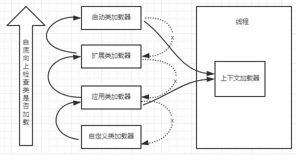


[dubbo源码解析-spi(一)](https://www.saowen.com/a/a15dc94434a957289c16d08b0e551c68b27ad5f2926b29d9e2660faf06c148f7)

[类加载器&线程上下文加载器](https://blog.csdn.net/anhuidelinger/article/details/53241967)


### 突破双亲委托模式

自定义ClassLoader，重载loadClass改变默认的双亲委托模式，先自己加载，加载不到在往上。

### 热替换

> 不同的ClassLoader加载的同名类是不同类型，无法互相转换和兼容。

热加载就是重新加载，成为一个新的class对象。


---

# 字节码执行


## Class字节码指令解释执行


```java
package cn.xiaowenjie.bytecode;

public class Calc {

    public int calc(){
        int a = 100;
        int b = 200;
        int c = 300;
        return (a+b)/c;
    }
}
```

**javap**
```
用法: javap <options> <classes>
其中, 可能的选项包括:
  -help  --help  -?        输出此用法消息
  -version                 版本信息
  -v  -verbose             输出附加信息
  -l                       输出行号和本地变量表
  -public                  仅显示公共类和成员
  -protected               显示受保护的/公共类和成员
  -package                 显示程序包/受保护的/公共类
                           和成员 (默认)
  -p  -private             显示所有类和成员
  -c                       对代码进行反汇编
  -s                       输出内部类型签名
  -sysinfo                 显示正在处理的类的
                           系统信息 (路径, 大小, 日期, MD5 散列)
  -constants               显示最终常量
  -classpath <path>        指定查找用户类文件的位置
  -cp <path>               指定查找用户类文件的位置
  -bootclasspath <path>    覆盖引导类文件的位置
```

使用 `javap -v Calc.class` 查看：

```
Classfile /D:/Github/xwjie/jvm/out/production/jvm/cn/xiaowenjie/bytecode/Calc.class
  Last modified 2018-11-23; size 427 bytes
  MD5 checksum 0edbd9bff1080c2535e9042539433146
  Compiled from "Calc.java"
public class cn.xiaowenjie.bytecode.Calc
  minor version: 0
  major version: 55
  flags: ACC_PUBLIC, ACC_SUPER
Constant pool:
   #1 = Methodref          #3.#19         // java/lang/Object."<init>":()V
   #2 = Class              #20            // cn/xiaowenjie/bytecode/Calc
   #3 = Class              #21            // java/lang/Object
   #4 = Utf8               <init>
   #5 = Utf8               ()V
   #6 = Utf8               Code
   #7 = Utf8               LineNumberTable
   #8 = Utf8               LocalVariableTable
   #9 = Utf8               this
  #10 = Utf8               Lcn/xiaowenjie/bytecode/Calc;
  #11 = Utf8               calc
  #12 = Utf8               ()I
  #13 = Utf8               a
  #14 = Utf8               I
  #15 = Utf8               b
  #16 = Utf8               c
  #17 = Utf8               SourceFile
  #18 = Utf8               Calc.java
  #19 = NameAndType        #4:#5          // "<init>":()V
  #20 = Utf8               cn/xiaowenjie/bytecode/Calc
  #21 = Utf8               java/lang/Object
{
  public cn.xiaowenjie.bytecode.Calc();
    descriptor: ()V
    flags: ACC_PUBLIC
    Code:
      stack=1, locals=1, args_size=1
         0: aload_0
         1: invokespecial #1                  // Method java/lang/Object."<init>":()V
         4: return
      LineNumberTable:
        line 3: 0
      LocalVariableTable:
        Start  Length  Slot  Name   Signature
            0       5     0  this   Lcn/xiaowenjie/bytecode/Calc;

  public int calc();
    descriptor: ()I
    flags: ACC_PUBLIC
    Code:
      stack=2, locals=4, args_size=1
         0: bipush        100
         2: istore_1
         3: sipush        200
         6: istore_2
         7: sipush        300
        10: istore_3
        11: iload_1
        12: iload_2
        13: iadd
        14: iload_3
        15: idiv
        16: ireturn
      LineNumberTable:
        line 6: 0
        line 7: 3
        line 8: 7
        line 9: 11
      LocalVariableTable:
        Start  Length  Slot  Name   Signature
            0      17     0  this   Lcn/xiaowenjie/bytecode/Calc;
            3      14     1     a   I
            7      10     2     b   I
           11       6     3     c   I
}
SourceFile: "Calc.java"
```

21个常量池

2个方法，第一个为自动生成的构造函数，自动生成的。第二个为我们编写的函数。方法体内，显示了栈大小，局部变量表大小，字节码指令，行号，局部变量表等信息。

>stack=2, locals=4, args_size=1

字节码前面的数字表示字节码偏移量。

>   0: bipush        100

bipush 指令1个字节，接受一个1字节的参数，所以一共2字节，下面的指令从2位置开始。bipush能处理-128-127的数，第二变量b是200，所以需要用sipush指令，他支持-32768-3276，sipush 指令1个字节，接受一个双字节的参数，所以一共三字节、

第一条指令执行完， 操作数栈里面是100。

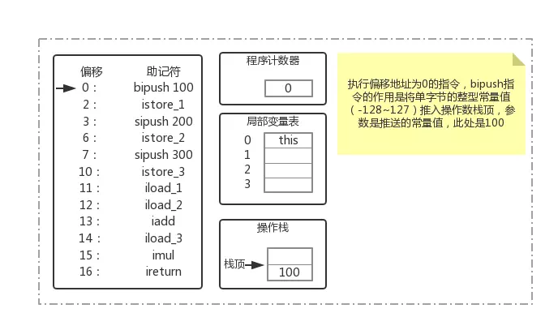

>   2: istore_1

操作数栈弹出一个元素，存放到局部变量表index为1的位置。（0是this，非静态方法的时候）

> 11: iload_1 \
> 12: iload_2 \
> 13: iadd

iload_1： 把局部变量index为1的元素压入操作数栈。

iload_2 执行完之后如下：（栈是先入的数在下面。）

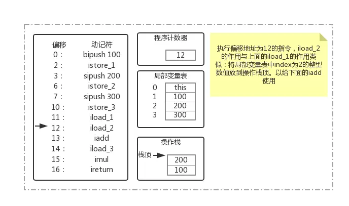

iadd：加法，操作数栈弹出2个数，然后做加法，结果在压回操作数栈。

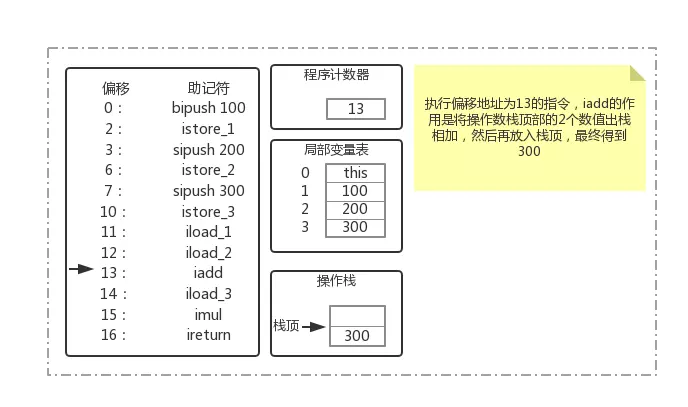

>  16: ireturn

ireturn： 将当前函数操作数栈的顶层元素弹出，并将这个元素压入调用函数的操作数栈。操作数栈的其他元素会被丢弃。

详细看下面的贴 [Class字节码指令解释执行](https://www.jianshu.com/p/ab29c1cfdd81)


## 常用指令

i表示整数，l表示长整数，f表示浮点数，d表示双精度浮点数，a表示对象引用。

### 常量入栈指令

* const系列
    * iconst_m1: -1压入操作数栈
    * iconst_x(x为0-5)
    * lconst_x 压long
    * dconst_x 压double
    * fconst_x 压f
* push系列
    * bipush
    * sipush
* ldc指令
    * 超过16位的，值会放到常量池，然后把常量池引用index传给ldc

测试代码：

```java
public void test(){
    // const 指令 => iconst_1
    int a = 1;

    // bipush  = > bipush 127
    int b = 127;

    // sipush => sipush 128
    int c = 128;

    // ldc 指令, 33333 会作为常量，常量的index会作为参数
    // => ldc  #2 // int 33333
    int a2 = 33333;

    float f = 0f;
    double d = 0d;
    long l  = 1L;
}
```

字节码：

```
 0: iconst_1
 1: istore_1
 2: bipush        127
 4: istore_2
 5: sipush        128
 8: istore_3
 9: ldc           #2                  // int 33333
11: istore        4
13: fconst_0
14: fstore        5
16: dconst_0
17: dstore        6
19: lconst_1
20: lstore        8
22: return
```

常量池：

```
Constant pool:
   #1 = Methodref          #4.#26         // java/lang/Object."<init>":()V
   #2 = Integer            33333
   #3 = Class              #27            // cn/xiaowenjie/bytecode/ConstDemo
   #4 = Class              #28            // java/lang/Object
```

### 局部变量压栈指令

* (x)load
* (x)load_n
* (x)aload

### 出栈装入局部变量表指令

store

### 通用型操作

* nop 空指令
* dup 复制栈顶元素（new之后常带）

### 类型转换指令

(x)2(y)

### 运算指令

### 对象/数组操作指令

* 创建指令
    * new
    * newarray
    * anewarray
    * multianewarray
* 字段访问指令
    * getfiled
    * putfield
    * getstatic
    * putstatic
* 类型检查指令
    * instanceof
    * chechcast 就是强转
* 数组操作指令
    * xastore
    * xaload

### 比较控制指令

* 比较指令
    * （x）cmp（y）
* 条件跳转指令
    * if（xx） 把栈顶元素弹出，测试是否满足条件，如果满足跳转给定位置
* 比较条件跳转指令
    * if_(i)cmp(xx)
* 多条件分支跳转（针对switch-case）
    * tableswitch（条件是连续的）
    * lookupswith（条件不连续）,jdk7的swith字符串，就是lookupswith hashcode 实现的。
* 无条件跳转
    * goto 

### 函数调用和返回

* 函数调用
    * invokevir
    * invokeinterface
    * invokespecial 
        * 特殊函数，如init函数
        * 私有函数（没有动态，所以可以静态绑定）
        * 父类方法
    * invokestatic
    * invokedynamic
    * 
* 返回指令
    * （x）return
    * void的时候就是return

### 同步控制

* monitorenter/monitorexit

使用monitorenter指令请求进入，如果当前对象的监视器计数器为0，准许进入，若为1，判断是否当前线程，是则进入，否则进行等待。

monitorenter/monitorexit 执行时，都需要在操作数栈顶压入对象，之后，monitorenter和monitorexit的锁定和释放都是针对这个对象的监视器进行的。

synchronize加在**方法**上的时候，看不到对应的字节码，而是在方法修饰符上看到，虚拟机会自动加指令。

## ASM框架

## java agent

2个方法。 

```java
public static void premain(String agentArgs, Instrumentation inst){
    inst.addTransformer(new ClassFileTransformer(){
        @Override
        public byte[] transform(  ClassLoader         loader,
                String              className,
                Class<?>            classBeingRedefined,
                ProtectionDomain    protectionDomain,
                byte[]              classfileBuffer)
        throws IllegalClassFormatException {
        return null;
    }
    });
}


public static void agentmain(String agentArgs, Instrumentation inst){

}
```


## 静态编译优化

优化分为2种：

* 编译时优化（静态）
    * 常量计算
        * 数字计算
        * 字符串拼接
    * 变量字符串使用StringBuilder代替
    * 基于常量条件语句裁剪
        * if（FLAG）
    * swith语句
        * swith 1，2，5 生成 tableswitch语句，自动填充3，4
* jit（just-in-time）即时编译（运行时）
    * 虚拟机3中执行方式，
        * 解释执行（不做jit编译）
            * java -Xint -version 开启
        * 混合模式（默认）
            * 超过阈值进行jit，-XX:CompileThreshold
        * 编译执行（不管是否热点代码，都会编译执行）
            * java -Xcomp -version 开启
    * -Xint

### 多级编译器

虚拟机有2中编译系统：

* 客户端编译器（C1）
    * -client 参数
* 服务端编译器（C2）
    * -server 参数

为了在C1和C2中平衡，分为0-4 5级。越高性能越好。使用 `-XX:+TieredCompilation -server -Xcomp` 参数

### OSR 栈上替换

### 方法内嵌

> -XX:+InLine 开启内嵌\  
> -XX:FreqInLineSize 多小的函数可以内嵌

### 设置代码缓存大小

---
End


